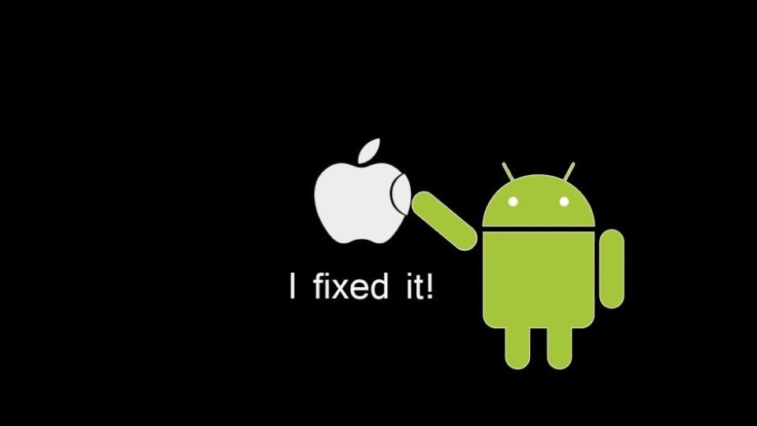
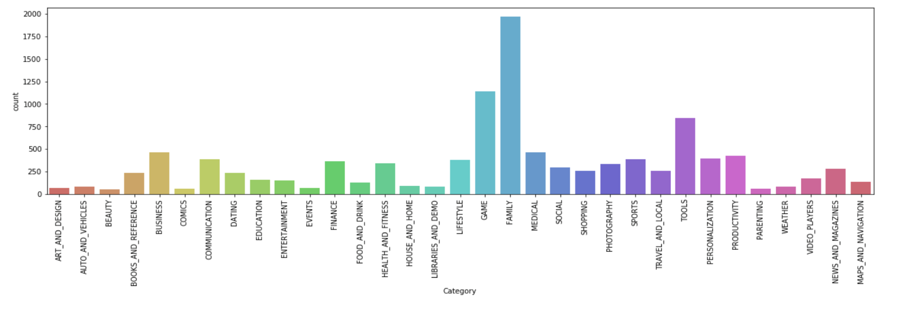
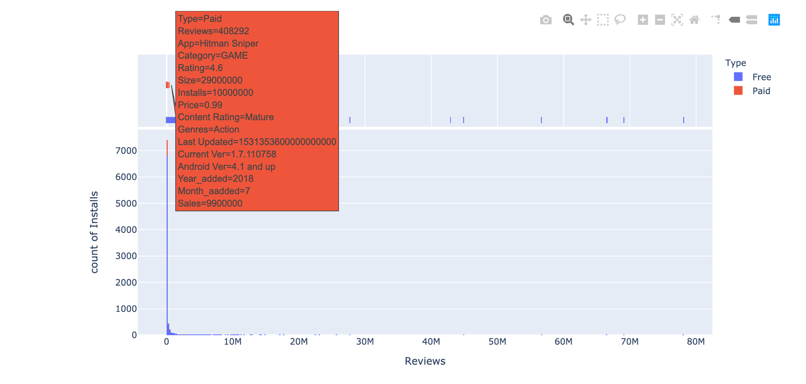
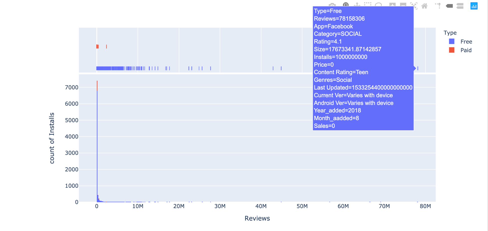
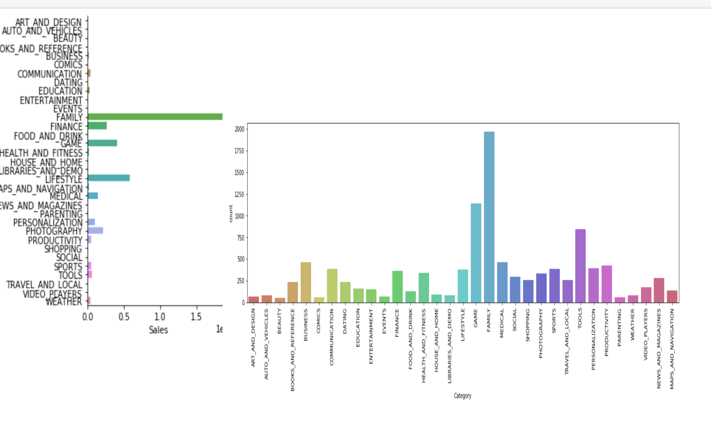

##Background:
The data has about google store rating apps data been collected on June 2019 it has thirteen features like Apps price, Category, installs and Rating and 10841 observation also 1487 of missing values.

##Goal:
To analyze and understand how android apps influence its users.
What the apps ratings and reviews system mean for users and proprietors
How do apps reviews and ratings system influence     
build model to predict new app could attract users

##Methodology:
google store data set csv file was loaded into panda library Dataframe structure for manipulation, cleaning, and modeling data has values were numbers, character and some special character like $, +, - ‘’
regex and lambda for remove all special characters to make the features types either categorical or numeric.

Android version, android current version and type have missing values filled up using the mode which the most frequent values in each feature.

Seanborn were used for plotting the and check the correlation between variables and the target feature

Plotting and analysis were accomplished on data with Plotty Express for statically graphs.
Engineered new features sales, year, month for statical analysis
Backward elimination were applied with regression where the p greater than five would be dropped.

##Analyis:
**Which category has the most applications on google store**

**[Which app that has the most sales on google store ?And on which category is that**

  **What Category and which app has the most downloaded from google store**

 **Which group make profit on google store**

##

##Conclusions & Recommendations

1. The most application category that has been rated by users are Family,   Tools, Games and Life style the new app developers should considered.

2. The application size has zero impact when to application development doesn’t matter
3. 92% of the share market are free applications however 8% make almost 4,000,000,000

4. Google launch their first app for sale on 2011 where the google store was  launched 2008
5. Finance and Tools are the most categories reviewed by visitors
